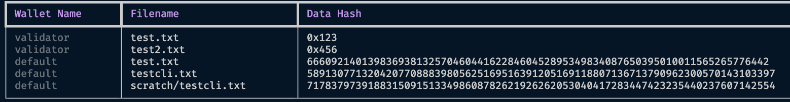
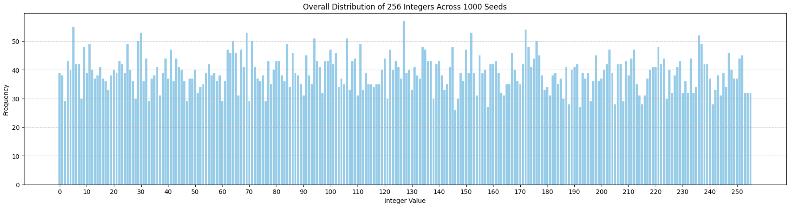

# FileTAO


FileTAO (Bittensor Subnet 21) implements a novel, multi-layered zero-knowledge interactive proof-of-spacetime algorithm by cleverly using Pedersen commitments, random challenges leveraging elliptic curve cryptography, sequential seed-based chained hash verification, and merkle proofs to achieve an efficient, robust, secure, and highly available decetralized storage system on the Bittensor network. The system validates on encrypted user data, such that miners are unaware of what data they are storing, and only end-users may encrypt/decrypt the data they provide with their bittensor wallet coldkey.

We consider this system to be an important stepping stone so that bittensor can fulfill it's mission of democratizing intelligence, and a decentralized AWS platform is a key brick in this wall. 

**NOTICE**: Using this software, you **must** agree to the Terms and Agreements provided in the [terms and conditions](TERMS.md) document. By downloading and running this software, you implicitly agree to these terms and conditions.

Currently supporting `python>=3.8,<3.11`.

> Note: The storage subnet is in an alpha stage and is subject to rapid development.

# Table of Contents for Subnet 21 (FileTAO)

1. [FileTAO](#FileTAO)
1. [Network Stats](#network-stats)
1. [Storage CLI Interface](#storage-cli-interface)
   - [Overview](#overview)
   - [Prerequisites](#prerequisites)
   - [Commands](#commands)
     - [Store: Storing Data on the Network](#store-storing-data-on-the-network)
     - [Retrieve: Retrieving Data from the Network](#retrieve-retrieving-data-from-the-network)
     - [Listing Stored Data](#listing-stored-data)
   - [Examples](#examples)
   - [General Options](#general-options)
   - [Notes](#notes)
1. [What is a Decentralized Storage Network (DSN)?](#what-is-a-decentralized-storage-network-dsn)
   - [Role of a Miner (Prover)](#role-of-a-miner-prover)
   - [Role of a Validator (Verifier)](#role-of-a-validator-verifier)
1. [Main Features of Subnet 21](#main-features-of-subnet-21)
   - [Zero-Knowledge Proof of Space-Time System](#zero-knowledge-proof-of-space-time-system)
   - [Chained Proof Challenges](#chained-proof-challenges)
   - [Data Encryption and Zero-Knowledge Proofs for Privacy Preservation](#data-encryption-and-zero-knowledge-proofs-for-privacy-preservation)
   - [Scalability and Reliability](#scalability-and-reliability)
   - [Advanced Cryptographic Techniques](#advanced-cryptographic-techniques)
   - [User-Centric Approach](#user-centric-approach)
1. [Zero Knowledge Proof-of-Spacetime](#zero-knowledge-proof-of-spacetime)
   - [Storage Phase](#storage-phase)
   - [Challenge Phase](#challenge-phase)
   - [Retrieval Phase](#retrieval-phase)
1. [Reward System](#reward-system)
1. [Epoch UID Selection](#epoch-uid-selection)
1. [Installation](#installation)
   - [Install Redis](#install-redis)
   - [Install PM2](#install-pm2)
   - [Running a Miner](#running-a-miner)
   - [Running a Validator](#running-a-validator)
   - [Running the API](#running-the-api)
   - [(Optional) Setup WandB](#setup-wandb)
1. [Local Subtensor](#local-subtensor)

# Storage CLI Interface

## Overview
The Storage CLI provides a user-friendly command-line interface for storing and retrieving data on the Bittensor network. It simplifies the process of data encryption, storage, and retrieval, ensuring security and ease of use. This tool is ideal for users who need to manage data securely on a decentralized network.


## Prerequisites
Before using the Storage CLI, ensure that Bittensor is installed and your wallet (hotkey and coldkey) is properly configured.

## Commands

### 1. Store: Storing Data on the Network
This command encrypts and stores data on the Bittensor network.

#### Subcommands
- `put`: Encrypt and store data.

#### Usage
```bash
ftcli store put --filepath <path-to-data> [options]
```

#### Options
- `--filepath <path-to-data>`: Path to the data file to be stored.
- `--hash_basepath <path>`: (Optional) Path to store the data hashes.
- `--stake_limit <float>`: (Optional) Stake limit to filter validator axons.
- `--wallet.name <name>`: (Optional) Wallet coldkey name.
- `--wallet.hotkey <name>`: (Optional) Hotkey name.

### 2. Retrieve: Retrieving Data from the Network
This command retrieves previously stored data from the Bittensor network.

#### Subcommands
- `list`: Lists all data associated with a specific coldkey.
- `get`: Retrieve and decrypt data.

#### Usage
```bash
ftcli retrieve get --data_hash <hash> [options]
```

#### Options
- `--data_hash <hash>`: Hash of the data to retrieve.
- `--hash_basepath <path>`: (Optional) Path where data hashes are stored.
- `--stake_limit <float>`: (Optional) Stake limit for validator axons.
- `--storage_basepath <path>`: (Optional) Path to store retrieved data.
- `--wallet.name <name>`: (Optional) Wallet coldkey name.
- `--wallet.hotkey <name>`: (Optional) Hotkey name.

### Listing Stored Data
Lists all data hashes stored on the network associated with the specified coldkey.

#### Usage
```bash
ftcli retrieve list [options]
```

#### Options
- `--hash_basepath <path>`: (Optional) Path where data hashes are stored.
- `--wallet.name <name>`: (Optional) Wallet coldkey name.

## Examples

### Storing Data
```bash
ftcli store put --filepath ./example.txt --wallet.name mywallet --wallet.hotkey myhotkey
```

### Retrieving Data
```bash
ftcli retrieve get --data_hash 123456789 --storage_basepath ./retrieved --wallet.name mywallet --wallet.hotkey myhotkey
```

### Listing Data
```bash
ftcli retrieve list --wallet.name mywallet
```



## General Options
- `--help`: Displays help information about CLI commands and options.

## Notes
- Ensure your wallet is configured and accessible.
- File paths should be absolute or relative to your current directory.
- Data hashes are unique identifiers for your stored data on the Bittensor network.

For detailed instructions and more information, visit the [Bittensor Documentation](https://docs.bittensor.com).


## What is a Decentralized Storage Network (DSN)?
A DSN is a network architecture where data storage and management are distributed across various locations, controlled by multiple participants rather than a single entity. This approach enhances data security, availability, and resistance to censorship.

### Role of a Miner (Prover)
A miner in this context refers to a network participant responsible for storing and managing data. They prove the integrity and availability of the data they store through cryptographic methods, ensuring compliance with network protocols.

### Role of a Validator (Verifier)
A validator, on the other hand is a consumer of the proofs generated by the miner. They are responsible for maintaining an index of where data is stored and associated metadata for managing the system and maintainng data integrity and security.

## Main Features of Subnet 21

### Zero-Knowledge Proof of Space-Time System
- **Proof of Space-Time:** At its core, the application is built around a novel Zero-Knowledge Proof of Space-Time (ZK-PoST) algorithm. This algorithm allows validators to confirm that miners have consistently stored data over a period of time, offering a robust measure of data availability and integrity across the network.

### Chained Proof Challenges
- **Continuous Verification via Chained Challenges:** Validators issue sequential cryptographic challenges to miners. These challenges are linked or 'chained' together, ensuring that miners cannot predict future challenges and must consistently store the data to pass ongoing verifications.
- **Dynamic Challenge-Response Protocol:** This protocol is crucial for maintaining an ongoing verification system. Each challenge is dependent on the response to the previous one, forming a chain of trust and verification over time.

### Data Encryption and Zero-Knowledge Proofs for Privacy Preservation
- **Data Privacy Through Zero-Knowledge Proofs:** Validators verify the presence and integrity of data without accessing the actual content. This approach ensures data privacy, as miners are required to prove data storage without revealing the entire data itself.
- **Data Encryption:** All data is encrypted using bittensor wallet coldkey public/private key pairs, providing plug-n-play data storage for existing bittensor users.
- **Efficient and Secure Validation:** The system is designed to perform these verifications efficiently, minimizing computational overhead while maximizing security and privacy.

### Scalability and Reliability
- **Scalable Network Design:** The system is built to scale, capable of handling increasing storage demands and network growth without compromising performance.
- **High Data Availability and Fault Tolerance:** Data redundancy across multiple miners and continuous verification ensures high data availability and robustness against node failures.

### Advanced Cryptographic Techniques
- **Elliptic Curve Cryptography and Pedersen Commitments:** The application utilizes advanced cryptographic techniques, including ECC for efficient cryptographic operations, Pedersen Commitments for secure and private data commitments, and Merkle Trees for efficient proof of ownership verification.
- For more information see this detailed blog [post](https://medium.com/coinmonks/zero-knowledge-proofs-um-what-a092f0ee9f28).

### User-Centric Approach
- **Simplified User Experience:** Despite the underlying complexity, the system provides a straightforward interface for users to store and manage their data.
- **Assurance of Data Integrity and Availability:** Users can be confident in the integrity and availability of their data, backed by continuous cryptographic verification.

This ZK Proof of Space-Time system represents a significant advancement in decentralized storage, offering an efficient, secure, and private solution for data storage needs. It ensures that miners are honest and data is securely stored, while maintaining user privacy and system integrity.

## Zero Knowledge Proof-of-Spacetime

The algorithm comprises three phases:
- **Storage**: Miners store data locally and prove to the verifier (validator) that they have commited to the entire data block
- **Challenge**: Random challenges are issued by validators without advance warning, and miners must recommit to the entire data in order respond with the correct merkle proof.
- **Retrieval**: Upon retrieving data, miners are challenged to generate an efficient proof based on a random seed value that is sent back with the original data for verification.

### Storage Phase

In the Store phase, the goal is to securely store data and create a commitment to prove its storage without revealing the data itself. The mathematical steps are:

Validators query miners to store user data that is encrypted by the end-user coldkey pubkey. The encrypted data is sent to miners along with a random seed, which the miners use to initiate a sequential chain of seed + hash verification proofs. The previous seed value and the data is required for each subsequent commitment proof. The miner then applies a Pedersen committment to the entire data using the random seed, and forwards the proofs to the validator.

Upon receipt, validators verify the commitment and the initial hash chain, storing the associated metadata.


1. **Data Encryption**:
   - Data `D` is encrypted using a symmetric encryption scheme whos keys are .
   - Encrypted Data: `encrypted_D = encrypt(D, key)`.

2. **Hashing and Commitment**:
   - Hash the encoded data with a unique random seed to create a unique identifier for the data.
   - Data Hash: `data_hash = hash(encrypted_D + r_seed)`.
   - Create a cryptographic commitment using an Elliptic Curve Commitment Scheme (ECC), which involves a commitment function `commit` with curve points `g` and `h`.
   - Pedersen Commitment: `(c, m, r) = commit(encrypted_D + seed)`, where `c` is the commitment, `m` is the message (or commitment hash), and `r` is the randomness used in the commitment.
   - Chained Hash Proof: `m` is used as the initial `C_0`, which contains the initial random seed and the data itself. The random seed is stored for the next challenge in the chain.

3. **Storage**:
   - Store the data (`E`) and the random seed (`r_seed`) in local storage.


### Challenge Phase
In the Challenge phase, the system verifies the possession of the data without actually retrieving the data itself.

Validators request the miner prove that it currently stores the data claimed by issuing an index-based challenge, where the miner must apply Pedersen committments to the entire data table given a random seed and a chunk size. 

Data is chunked according to the chunk size, and each slice is committed to using a Pederson commitment with the current random seed. Each commitment is appended to a merkle tree, and a subsequent proof is generated to obtain the path along the merkle tree such that a validator can verify the random seed was indeed used to commit to each data chunk at challenge time, thus proving the miner has the data at time of the challenge. 

The mathematical operations involved in the `Store`, `Challenge`, and `Retrieve` phases of this data storage and verification system can be broken down into a few key steps. Here's a simplified explanation for each phase:


1. **Chunking Data**:
   - The encrypted data is split into chunks: `chunks = chunk(encrypted_D, chunk_size)`.

2. **Selecting a Chunk for Challenge**:
   - A random chunk is selected for the challenge.
   - Selected Chunk: `chunk_j = chunks[j]`.

3. **Computing Commitment for the Chunk**:
   - A commitment is computed for the selected chunk.
   - Commitment for Chunk: `(c_j, m_j, r_j) = commit(chunk_j + seed)`.

4. **Creating a Merkle Tree**:
   - A Merkle tree is constructed using all chunk commitments.
   - Merkle Tree: `merkle_tree = MerkleTree([c_1, c_2, ..., c_n])`.

5. **Generating Merkle Proof**:
   - A Merkle proof is generated for the selected chunk to recreate the path along the merkle tree to the leaf that represents `chunk_j`.
   - Merkle Proof: `proof_j = merkle_tree.get_proof(j)`.

6. **Generating chained commitment**:
   - Compute commitment hash `Cn = hash( hash( encrypted_D + prev_seed ) + new_seed )`
   - Update previous seed `prev_seed = new_seed`

7. **Response**:
   - The challenge response includes the Pedersen elliptic curve commitment, the chained commitment hash, the Merkle proof, and the Merkle tree root.
   - The validator verifies the triple of proofs: chained commitment, elliptic-curve commitment, and the merkle proof.
 

### Retrieval Phase

In this phase, the data is retrieved, decrypted, and its integrity is verified.

1. **Fetching Encrypted Data**:
   - The encrypted data is fetched from the database based on its hash.
   - `encrypted_D = fetch(data_hash)`.

2. **Chained Verification Challenge**:
   - A new commitment is computed on the encrypted data with a new seed and the previous seed.
       - `Ch = hash( hash( encrypted_D + prev_seed ) + new_seed )`.

3. **Data Integrity Check**:
   - The retrieved data's integrity is verified by checking if the newly computed commitment matches the expected value.
   - `verify_chained(commitment, expected_commitment) == True`.

5. **Decryption**:
   - The data is decrypted using the symmetric encryption key and returned to the end-user.
   - Decrypted Data: `D = decrypt(encrypted_D, key)`.

In each phase, cryptographic primitives ensure data integrity and confidentiality. The encryption and commitment schemes ensure the data's security, while Merkle trees and random challenges provide a robust method for verifying data possession without revealing the actual data.

In each phase, cryptographic primitives like hashing, commitment schemes (e.g., Elliptic Curve Cryptography and Pedersen commitments), and data structures like Merkle trees are employed to ensure the integrity, confidentiality, and availability of the data. The use of seeds and randomness in commitments adds an additional layer of security and ensures that each instance of data storage and retrieval is unique and verifiable. See [here](https://kndrck.co/posts/efficient-merkletrees-zk-proofs/) for more information.


## Reward System

In FileTAO's decentralized storage system, optimal behavior is crucial for the overall health and efficiency of the network. Miners play a vital role in maintaining this ecosystem, and their actions directly impact their rewards and standing within the subnet. We have implemented a tier-based reward system to encourage proper behavior, successful challenge completions, and consistent performance.

Failing to pass either challenge or retrieval verifications incur negative rewards. This is doubly destructive, as rolling statistics are continuously logged to periodically compute which tier a given miner hotkey belongs to. When a miner achieves the threshold for the next tier, the rewards that miner recieves proportionally increase. Conversely, when a miner drops below the threshold of the previous tier, that miner's rewards are slashed such that they recieve rewards proportionally to the immediately lower tier.


#### Tier System:
The tier system classifies miners into five distinct categories, each with specific requirements and storage limits. These tiers are designed to reward miners based on their performance, reliability, and the total volume of data they can store.

1. 🎇 **Super Saiyan Tier:** 
   - **Storage Limit:** 1 Exabyte (EB)
   - **Store Success Rate:** 99.9% (1/1000 chance of failure)
   - **Retrieval Success Rate:** 99.9%
   - **Challenge Success Rate:** 99.9%
   - **Minimum Successes Required:** 100,000
   - **Reward Factor:** 2.0 (200% rewards)

2. 💎 **Diamond Tier:**
   - **Storage Limit:** 1 Petabyte (PB)
   - **Store Success Rate:** 99% (1/100 chance of failure)
   - **Retrieval Success Rate:** 99%
   - **Challenge Success Rate:** 99%
   - **Minimum Successes Required:** 50,000
   - **Reward Factor:** 1.0 (100% rewards)

3. 🥇 **Gold Tier:**
   - **Storage Limit:** 100 Terabytes (TB)
   - **Store Success Rate:** 97.5% (1/50 chance of failure)
   - **Retrieval Success Rate:** 97.5%
   - **Challenge Success Rate:** 97.5%
   - **Minimum Successes Required:** 5,000
   - **Reward Factor:** 0.888 (88.8% rewards)

4. 🥈 **Silver Tier:**
   - **Storage Limit:** 10 Terabytes (TB)
   - **Store Success Rate:** 95% (1/20 chance of failure)
   - **Retrieval Success Rate:** 95%
   - **Challenge Success Rate:** 95%
   - **Minimum Successes Required:** 1,000
   - **Reward Factor:** 0.555 (55.5% rewards)

5. 🥉 **Bronze Tier:**
   - **Storage Limit:** 1 Terabyte (TB)
   - **Store Success Rate:** Not specifically defined for this tier
   - **Retrieval Success Rate:** Not specifically defined for this tier
   - **Challenge Success Rate:** Not specifically defined for this tier
   - **Minimum Successes Required:** Not specifically defined for this tier
   - **Reward Factor:** 0.333 (33.3% rewards)

#### Importance of Tier System:
- **Encourages High Performance:** Higher tiers reward miners with greater benefits, motivating them to maintain high success rates.
- **Enhances Network Reliability:** The tier system ensures that only the most reliable and efficient miners handle significant volumes of data, enhancing the overall reliability of the network.
- **Fair Reward Distribution:** The reward factors are proportional to the miners' tier, ensuring a fair distribution of rewards based on performance.

#### Maintaining and Advancing Tiers:
- To advance to a higher tier, miners must consistently achieve the required success rates in their operations.
- Periodic evaluations are conducted to ensure miners maintain the necessary performance standards to stay in their respective tiers.
- Advancing to a higher tier takes time. In order to ascend to the first higher tier (Silver), it takes at least 1000 sucessful requests, whether they are challenge requests, store requests, or retrie requests and must maintain a 95% success rate in all categories. 
- Depending on how often a miner is queried, how many validators are operating at one given time, and primarily the performance of the miner, this can take several hours to several days. Assuming full 64 validator slots are occupied, this should take a matter of hours.

Here is a distribution of UIDs queried over 1000 blocks based on block hash:


Assuming perfect performance, that out of ~200 miner UIDs, each of which is queried rougly 34 times every 1000 rounds, namely a 3.4% chance every query round, one can expect to reach the next tier within 

```bash
hours = total_successes / prob_of_query_per_round * time_per_round / 3600
hours = 98 # roughly 4 days at perfect performance (no challenge failures)
```

#### Conclusion:
The tier system in FileTAO's decentralized storage network plays a pivotal role in ensuring the network's efficiency and reliability. By setting clear performance benchmarks and rewarding miners accordingly, the system fosters a competitive yet fair environment. This encourages continuous improvement among miners, ultimately leading to a robust and trustworthy decentralized storage solution.


**Why Optimal Behavior Matters:**
1. **Reliability:** Miners who consistently store, retrieve, and pass challenges with high success rates ensure the reliability and integrity of the network.
2. **Trust:** High-performing miners build trust in the network, attracting more users and increasing the overall value of the system.
3. **Efficiency:** Optimal behavior leads to a more efficient network, reducing the likelihood of data loss and ensuring fast, reliable access to stored information.

**Tier-Based Reward System:**
- **Tiers:** We classify miners into four tiers – Diamond, Gold, Silver, and Bronze – based on their performance metrics.
- **Performance Metrics:** These include the success rate in storage, retrieval, and challenge tasks, as well as the total number of successful operations.
- **Higher Rewards for Higher Tiers:** Miners in higher tiers receive a greater proportion of the rewards, reflecting their superior performance and contribution to the network.

**Moving Up Tiers:**
- To ascend to a higher tier, a miner must maintain high success rates and achieve a set number of total successes.
- This progression system incentivizes continuous improvement and excellence in mining operations.

**Graphical Representation:**
- The graph below illustrates how rewards increase as miners advance through the tiers. It visually represents the potential growth in earnings as miners optimize their operations and maintain high standards of performance.


The tier-based reward system is designed to promote optimal behavior among miners, ensuring the health and efficiency of the decentralized storage network. By aligning miners' interests with those of the network, we create a robust, trustworthy, and efficient storage solution.

### Speed and Reliability in Decentralized Storage Mining

In the context of FileTAO's decentralized storage system, speed and reliability are critical factors that significantly influence the performance and reputation of miners. These factors not only affect the efficiency of data storage and retrieval but also play a crucial role in the overall user experience and the robustness of the network.

#### Importance of Speed:
1. **Quick Data Access:** Fast response times in data storage and retrieval operations are essential for a seamless user experience. Miners with quicker response times enhance the network's ability to serve data efficiently.
2. **Improved Network Performance:** Speedy processing of tasks contributes to the overall performance of the network, reducing bottlenecks and ensuring smooth data flow.
3. **Advantage in Reward Scaling:** The implemented reward scaling mechanisms favor faster response times. Miners who consistently provide quick services are likely to receive higher rewards due to better performance metrics.

#### Importance of Reliability:
1. **Data Integrity:** Reliable storage and retrieval ensure that data remains intact and accessible when needed. This is vital for maintaining the trust of users who rely on the network for data storage.
2. **Challenge Success Rate:** A high success rate in passing challenges signifies a miner's reliability. It shows their commitment to maintaining the network's integrity and their capability to meet the required standards.
3. **Tier Advancement and Stability:** Reliable miners have a better chance of advancing to higher tiers and maintaining their position. This stability is rewarded with increased earning potential and recognition within the network.

#### Reward Scaling Mechanisms:
1. **Sigmoid and Min-Max Scaling:** The reward scaling is based on response times, using either an adjusted sigmoid function or min-max normalization. This approach rewards faster and more reliable miners, aligning their incentives with the network's goals.
2. **Tier-Based Reward Factors:** Each tier has an associated reward factor, which determines the proportion of rewards received by the miner. Higher tiers, achieved through consistent performance, offer greater rewards.


## Epoch UID selection
Miners are chosen pseudorandomly using the current block hash as a random seed. This allows for public verification of which miners are selected for each challenge round (3 blocks).


For example:
```python
block_hash = get_block_hash(subtensor)
random.seed(block_hash)

miner_uids = get_query_miners(metagraph, k = 3)
miner_uids
>>> [0, 4, 9] # Only these miners are allowed to be challenged this round (3 blocks, ~36 sec)
```

## Installation
```bash
git clone https://github.com/ifrit98/storage-subnet
cd storage-subnet
python -m pip install -e .
```

### Install Redis
Install Redis on your host system.

Linux [instructions](https://redis.io/docs/install/install-redis/install-redis-on-linux/)

```bash
sudo apt install lsb-release curl gpg

curl -fsSL https://packages.redis.io/gpg | sudo gpg --dearmor -o /usr/share/keyrings/redis-archive-keyring.gpg

echo "deb [signed-by=/usr/share/keyrings/redis-archive-keyring.gpg] https://packages.redis.io/deb $(lsb_release -cs) main" | sudo tee /etc/apt/sources.list.d/redis.list

sudo apt-get update
sudo apt-get install redis
```

Ensure the local Redis server is started.

```bash
sudo systemctl status redis-server.service
```

You should see output like:
```
● redis-server.service - Advanced key-value store
     Loaded: loaded (/lib/systemd/system/redis-server.service; disabled; vendor preset: enabled)
     Active: active (running) since Thu 2023-11-16 22:35:42 EST; 3min 25s ago
       Docs: http://redis.io/documentation,
             man:redis-server(1)
   Main PID: 31881 (redis-server)
     Status: "Ready to accept connections"
      Tasks: 5 (limit: 38370)
     Memory: 2.9M
        CPU: 387ms
     CGroup: /system.slice/redis-server.service
             └─31881 "/usr/bin/redis-server 127.0.0.1:6379" "" "" "" "" "" "" ""

Nov 16 22:35:42 user systemd[1]: Starting Advanced key-value store...
Nov 16 22:35:42 user systemd[1]: Started Advanced key-value store.
```

#### Redis troubleshooting
If you have problems with connecting to redis or it is not active for some reason, try:

(1) Look for existing processes on the default redis port (6379)
```
sudo lsof -i:6379
```

If anything displays, like in the example below:

```bash
COMMAND    PID   USER   FD   TYPE    DEVICE SIZE/OFF NODE NAME
python3 961206   user   33u  IPv4 455676435      0t0  TCP 123.456.111.22:58162->111.222.333.44.bc.googleusercontent.com:6379 (ESTABLISHED)

```

Look for the process ID under `PID` and kill it

```bash
kill -9 <PID>

#e.g.
kill -9 961206
```

(2) Restarting the service
```bash
systemctl restart redis
```

### Install PM2
This will allow you to use the process manager `pm2` for easily setting up your miner or validator.

Install nodejs and npm
```bash
sudo apt install nodejs npm
```

Once this compeltes, install pm2 globally
```bash
sudo npm install pm2 -g
```


### Running a miner
You can run a miner in your base environment like so:

```bash
python neurons/miner.py --wallet.name <NAME> --wallet.hotkey <HOTKEY> --logging.debug
```

However, it is recommended to use a process manager, such as `pm2`. This can be done simply:

```bash
pm2 start <path-to-script> --interpreter <path-to-python-binary> --name <unique-name> -- <program-args..,>
```

For example running a miner:
```bash
pm2 start /home/user/storage-subnet/neurons/miner.py --interpreter /home/user/miniconda3/envs/sn21/bin/python --name miner -- --netuid 21 --wandb.off --wallet.name default --wallet.hotkey miner  --axon.port 8888 --logging.debug
```

> Make sure to use absolute paths when executing your pm2 command.


#### Options

- `--netuid`: Specifies the chain subnet uid. Default: 21.
- `--miner.name`: Name of the miner, used for organizing logs and data. Default: "core_storage_miner".
- `--miner.device`: Device to run the miner on, e.g., "cuda" for GPUs or "cpu" for CPU. Default depends on CUDA availability.
- `--miner.verbose`: Enables verbose logging. Default: False.

- `--database.host`: Hostname of the redis database. Default: "localhost".
- `--database.port`: Port for the redis database. Default: 6379.
- `--database.index`: Redis database index. Default: 0.
- `--database.directory`: Directory to store local data. Default: "~/.data".

- `--miner.set_weights_wait_for_inclusion`: Wether to wait for the set_weights extrinsic to enter a block. Default: False.
- `--miner.set_weights_wait_for_finalization`: Wether to wait for the set_weights extrinsic to be finalized on the chain. Default: False.

- `--miner.blacklist.blacklist`: List of hotkeys to blacklist. Default: [].
- `--miner.blacklist.whitelist`: List of hotkeys to whitelist. Default: [].
- `--miner.blacklist.force_validator_permit`: If True, only allows requests from validators. Default: False.
- `--miner.blacklist.allow_non_registered`: If True, allows non-registered hotkeys to mine. Default: False.
- `--miner.blacklist.minimum_stake_requirement`: Minimum stake requirement for participating hotkeys. Default: 0.0.
- `--miner.blacklist.min_request_period`: Time period (in minutes) to serve a maximum number of requests per hotkey. Default: 5.

- `--miner.priority.default`: Default priority for non-registered requests. Default: 0.0.
- `--miner.priority.time_stake_multiplicate`: Time (in minutes) to double the importance of stake in the priority queue. Default: 10.
- `--miner.priority.len_request_timestamps`: Number of historical request timestamps to record. Default: 50.

- `--miner.no_set_weights`: If True, the miner does not set weights on the chain. Default: False.
- `--miner.no_serve`: If True, the miner does not serve requests. Default: False.
- `--miner.no_start_axon`: If True, the miner does not start the axon server. Default: False.

- `--miner.mock_subtensor`: If True, uses a mock subtensor for testing. Default: False.

- `--wandb.off`: Disables Weight and Biases logging. Default: False.
- `--wandb.project_name`: Project name for WandB logging. Default: "philanthropic-thunder".
- `--wandb.entity`: WandB entity (username or team name) for the run. Default: "philanthrope".
- `--wandb.offline`: Runs WandB in offline mode. Default: False.
- `--wandb.weights_step_length`: Steps interval for logging weights to WandB. Default: 10.
- `--wandb.run_step_length`: Steps interval for a new run rollover in WandB. Default: 1500.
- `--wandb.notes`: Notes to add to the WandB run. Default: "".

These options allow you to configure the miner's behavior, database connections, blacklist/whitelist settings, priority handling, and integration with monitoring tools like WandB. Adjust these settings based on your mining setup and requirements.


#### Data migration
If for whatever reason you need to migrate the data in your hard drive configured with `--database.directory` to a new directory than is reflected in the Redis index, then you can do it by simply running the script in `scripts/migrate_database_directory.sh`. 

When should you run the migration script?:
- if you want to specify a different --database.directory
- if your data has moved but your redis index has not reflected this change

```bash
bash scripts/migrate_database_directory.sh <OLD_PATH> <NEW_PATH> <DATABASE_INDEX>
```


Example usage from the top-level directory `storage-subnet`:

```bash
bash scripts/migrate_database_directory.sh ~/.data ~/.new_data_path 0 


Migrating database from ~/.data to ~/.new_data_path ...

2023-12-28 21:16:25.940 |       INFO       | Attempting miner data migration to /home/user/.new_data_path
2023-12-28 21:16:25.940 |       INFO       | Connecting to Redis at db=0...
2023-12-28 21:16:25.943 |     SUCCESS      | All data was migrated to the new directory.
```


### Running a validator
```bash
python neurons/validator.py --wallet.name <NAME> --wallet.hotkey <HOTKEY>
```

> Note: If you are running a validator, you should also be running an API node. This increases resilience and allows greater volumes of data to be stored efficiently on the network.

A dummy wallet is automatically configured and used for all encryption on the network as a validator. The registered coldkey is not exposed. 

Run a validator using `pm2`:
```bash
pm2 start /home/user/storage-subnet/neurons/validator.py --interpreter /home/user/miniconda3/envs/sn21/bin/python --name validator -- --netuid 21 --logging.debug --wallet.name default --wallet.hotkey validator
```

#### Options

- `--neuron.name`: Specifies the name of the validator neuron. Default: "core_storage_validator".
- `--neuron.device`: The device to run the validator on (e.g., "cuda" for GPU, "cpu" for CPU). Default: "cuda" if CUDA is available, else "cpu".
- `--neuron.curve`: The elliptic curve used for cryptography. Only "P-256" is currently available.
- `--neuron.maxsize`: The maximum size of random data to store. If `None`, a lognormal random Gaussian distribution is used (default: `None`).
- `--neuron.min_chunk_size`: The minimum chunk size of random data for challenges. Default: 256.
- `--neuron.override_chunk_size`: Overrides the random chunk size for splitting data into challenges. Default: 0 (no override).
- `--neuron.store_redundancy`: The number of miners to store each piece of data on. Default: 3.
- `--neuron.store_step_length`: Steps before a random store epoch is complete. Default: 5.
- `--neuron.challenge_sample_size`: The number of miners to challenge at a time, targeting ~90 miners per epoch. Default: 10.
- `--neuron.retrieve_step_length`: Steps before a random retrieve epoch is complete. Default: 5.
- `--neuron.tier_update_step_length`: Steps before a tier update epoch is complete. Default: 100.
- `--neuron.set_weights_epoch_length`: Blocks until the miner sets weights on chain. Default: 200.
- `--neuron.disable_log_rewards`: If set, disables all reward logging to suppress function values from being logged (e.g., to WandB). Default: False.
- `--neuron.chunk_factor`: The factor to divide data into chunks. Default: 4.
- `--neuron.num_concurrent_forwards`: The number of concurrent forward requests running at any time. Default: 1.
- `--neuron.disable_set_weights`: If set, disables setting weights on the chain. Default: False.
- `--neuron.moving_average_alpha`: The alpha parameter for the moving average, indicating new observation weight. Default: 0.05.
- `--neuron.semaphore_size`: The limit on concurrent asynchronous calls. Default: 256.
- `--neuron.store_timeout`: Timeout for store data queries. Default: 60 seconds.
- `--neuron.challenge_timeout`: Timeout for challenge data queries. Default: 30 seconds.
- `--neuron.retrieve_timeout`: Timeout for retrieve data queries. Default: 60 seconds.
- `--neuron.checkpoint_block_length`: Blocks before a checkpoint is saved. Default: 100.
- `--neuron.blocks_per_step`: Blocks before a step is taken in the mining process. Default: 3.
- `--neuron.events_retention_size`: File size for retaining event logs (e.g., "2 GB"). Default: "2 GB".
- `--neuron.dont_save_events`: If set, event logs will not be saved to a file. Default: False.
- `--neuron.vpermit_tao_limit`: The maximum TAO allowed for querying a validator with a vpermit. Default: 500.
- `--neuron.verbose`: If set, detailed verbose logs will be printed. Default: False.
- `--neuron.log_responses`: If set, all responses will be logged. Note: These logs can be extensive. Default: False.
- `--neuron.data_ttl`: The number of blocks before stored challenge data expires. Default: 50000 (approximately 7 days).
- `--neuron.profile`: If set, network and I/O actions will be profiled. Default: False.

- `--database.host`: Hostname of the Redis database. Default: "localhost".
- `--database.port`: Port of the Redis database. Default: 6379.
- `--database.index`: The database number for the Redis instance. Default: 1.

These options allow you to fine-tune the behavior, storage, and network interaction of the validator neuron. Adjust these settings based on your specific requirements and infrastructure.

> Note: Challenge data lives by default for 5000 blocks in the validator index. This means after 7 days the data is removed and is no longer queried by the validator. This allows miners to recover who have lost challenge data

### Running the API
Similar to running a validator, however this exposes two axon endpoints to `store` and `retrieve` data using your registered hotkey on SN21. You can gate access however you choose using the blacklist functions for each endpoint, and as a default all hotkeys are blacklisted except explicitly whitelisted ones in the `storage/validator/config.py` file. It is **strongly** encouraged to carefully consider your use case and how you will expose this endpoint.

```bash
python neurons/api.py --wallet.name <NAME> --wallet.hotkey <HOTKEY>
```

#### Options

- `--api.store_timeout`: The timeout (in seconds) for store data queries. This is the time allowed for a store operation before it times out. Default: 60 seconds.

- `--api.retrieve_timeout`: The timeout (in seconds) for retrieve data queries. This is the time allowed for a retrieve operation before it times out. Default: 60 seconds.

- `--api.ping_timeout`: The timeout (in seconds) for ping data queries. This is the time allowed for a ping operation before it times out. Useful for checking network latency and availability. Default: 2 seconds.

- `--api.whitelisted_hotkeys`: A list of whitelisted hotkeys. Only these hotkeys will be allowed to interact with the API. Default: [] (empty list, meaning no restrictions unless specified).

These options are crucial for managing the behavior and security of your API interactions. The timeouts ensure that operations do not hang indefinitely, while the whitelisted hotkeys provide a mechanism to restrict access to trusted entities. Adjust these settings based on your operational requirements and security considerations.


### Setup WandB

Weights & Biases (WANDB) is a popular tool for tracking and visualizing machine learning experiments. To use it effectively, you need to log into your WANDB account and set your API key on your system. Here's a step-by-step guide on how to do this on Ubuntu:

#### Step 1: Installation of WANDB

Before logging in, make sure you have the WANDB Python package installed. If you haven't installed it yet, you can do so using pip:

```bash
# Should already be installed with storage repo
pip install wandb
```

#### Step 2: Obtain Your API Key

1. Log in to your Weights & Biases account through your web browser.
2. Go to your account settings, usually accessible from the top right corner under your profile.
3. Find the section labeled "API keys".
4. Copy your API key. It's a long string of characters unique to your account.

#### Step 3: Setting Up the API Key in Ubuntu

To configure your WANDB API key on your Ubuntu machine, follow these steps:

1. **Open Terminal**: You can do this by searching for 'Terminal' in your applications menu, or by using the keyboard shortcut `Ctrl + Alt + T`.

2. **Log into WANDB**: Run the following command in the terminal:

   ```bash
   wandb login
   ```

3. **Enter Your API Key**: When prompted, paste the API key you copied from your WANDB account settings. 

   - After pasting your API key, press `Enter`.
   - WANDB should display a message confirming that you are logged in.

4. **Verifying the Login**: To verify that the API key was set correctly, you can start a small test script in Python that uses WANDB. If everything is set up correctly, the script should run without any authentication errors.

5. **Setting API Key Environment Variable (Optional)**: If you prefer not to log in every time, you can set your API key as an environment variable in your `~/.bashrc` or `~/.bash_profile` file:

   ```bash
   echo 'export WANDB_API_KEY=your_api_key' >> ~/.bashrc
   source ~/.bashrc
   ```

   Replace `your_api_key` with the actual API key. This method automatically authenticates you with wandb every time you open a new terminal session.

#### Tips and Best Practices

- **Security**: Keep your API key confidential. Do not share it or commit it to public repositories.
- **Troubleshooting**: If you encounter issues, check for common problems like incorrect API key entry or network issues.
- **Usage in Scripts**: For using WANDB in your Python scripts, refer to the WANDB documentation for proper initialization and usage patterns.

Following these steps, you should be able to successfully log into WANDB and set up your API key on your Ubuntu machine, enabling seamless integration of WANDB in your machine learning workflows.

#### Compute Requirements
No GPU is currently required to run either a validator or miner. This may change in the future for accelerating the proof and/or verification system.

See [`min_compute.yml`](min_compute.yml) for complete details on minimum and recommended requirements.


### Local Subtensor

Availability is *critical* in storage in general and SN21, specifically. The reward mechanism punishes failed challenges and retrievals, even if the reason for that failure is unavailability, not only explicitly incorrect proofs or intentionally malicious behavior. It is possible to experience intermittent connectivity with the free provided endpoints for subtensor connections.

It is *highly* recommended that all miners and validators run their own local subtensor node. This will resolve the many issues commonly found with intermittent connectivity across all subents.

To start your miner/validator using your local node, include the flag `--subtensor.network local` into your startup parameters.

### Docker installation
For easiest installation, run subtensor inside of the foundation-provided docker container.

For official docker and docker-compose install instructions, see [here](https://docs.docker.com/engine/install/ubuntu/#installation-methods) and [here](https://docs.docker.com/compose/install/linux/#install-using-the-repository), respectively.

```bash
# Install the docker compose plugin
sudo apt-get update
sudo apt-get install docker-compose-plugin

# Clone subtensor
git clone https://github.com/opentensor/subtensor
cd subtensor

# Start the subtensor container on port 9944
sudo docker compose up -d
```

#### Quick Installation
Provided are two scripts to build subtensor, and then to run it inside a pm2 process as a convenience. If you have more complicated needs, see the [subtensor](https://github.com/opentensor/subtensor/) repo for more details and understanding.
```bash
# Installs dependencies and builds the subtensor binary
./scripts/build_subtensor_linux.sh

# Runs local subtensor in a pm2 process (NOTE: this can take several hours to sync chain history)
# Make sure the directory is configured properly to run from the built subtensor binary
# This lives in `./subtensor/target/release/node-subtensor`, so if your subtensor repo lives in
# ~/storage-subnet/subtensor (by default) then you would need to cd in, e.g.:
# cd ~/storage-subnet/subtensor

# Run the script to start subtensor
./scripts/start_local_subtensor.sh
```

You should see output like this in your pm2 logs for the process at startup:

```bash
pm2 logs subtensor

1|subtenso | 2023-12-22 14:21:30 🔨 Initializing Genesis block/state (state: 0x4015…9643, header-hash: 0x2f05…6c03)    
1|subtenso | 2023-12-22 14:21:30 👴 Loading GRANDPA authority set from genesis on what appears to be first startup.    
1|subtenso | 2023-12-22 14:21:30 🏷  Local node identity is: 12D3KooWAXnooHcMSnMpML6ooVLzFwsmt5umFhCkmkxH88LvP5gm    
1|subtenso | 2023-12-22 14:21:30 💻 Operating system: linux    
1|subtenso | 2023-12-22 14:21:30 💻 CPU architecture: aarch64    
1|subtenso | 2023-12-22 14:21:30 💻 Target environment: gnu    
1|subtenso | 2023-12-22 14:21:30 💻 Memory: 62890MB    
1|subtenso | 2023-12-22 14:21:30 💻 Kernel: 5.15.0-1051-aws    
1|subtenso | 2023-12-22 14:21:30 💻 Linux distribution: Ubuntu 20.04.6 LTS    
1|subtenso | 2023-12-22 14:21:30 💻 Virtual machine: no    
1|subtenso | 2023-12-22 14:21:30 📦 Highest known block at #0    
1|subtenso | 2023-12-22 14:21:30 〽️ Prometheus exporter started at 127.0.0.1:9615    
1|subtenso | 2023-12-22 14:21:30 Running JSON-RPC HTTP server: addr=0.0.0.0:9933, allowed origins=["*"]    
1|subtenso | 2023-12-22 14:21:30 Running JSON-RPC WS server: addr=0.0.0.0:9944, allowed origins=["*"]    
1|subtenso | 2023-12-22 14:21:31 🔍 Discovered new external address for our node: /ip4/52.56.34.197/tcp/30333/ws/p2p/12D3KooWAXnooHcMSnMpML6ooVLzFwsmt5umFhCkmkxH88LvP5gm    

1|subtensor  | 2023-12-22 14:21:35 ⏩ Warping, Downloading state, 2.74 Mib (56 peers), best: #0 (0x2f05…6c03), finalized #0 (0x2f05…6c03), ⬇ 498.3kiB/s ⬆ 41.3kiB/s    
1|subtensor  | 2023-12-22 14:21:40 ⏩ Warping, Downloading state, 11.25 Mib (110 peers), best: #0 (0x2f05…6c03), finalized #0 (0x2f05…6c03), ⬇ 1.1MiB/s ⬆ 37.0kiB/s    
1|subtensor  | 2023-12-22 14:21:45 ⏩ Warping, Downloading state, 20.22 Mib (163 peers), best: #0 (0x2f05…6c03), finalized #0 (0x2f05…6c03), ⬇ 1.2MiB/s ⬆ 48.7kiB/s 
```
